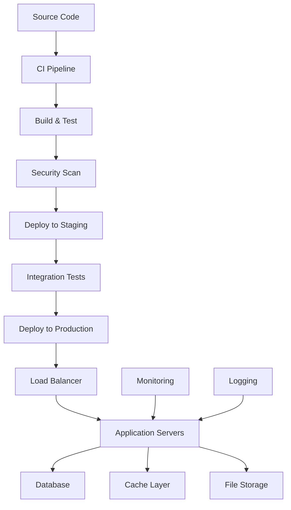
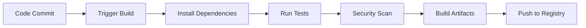
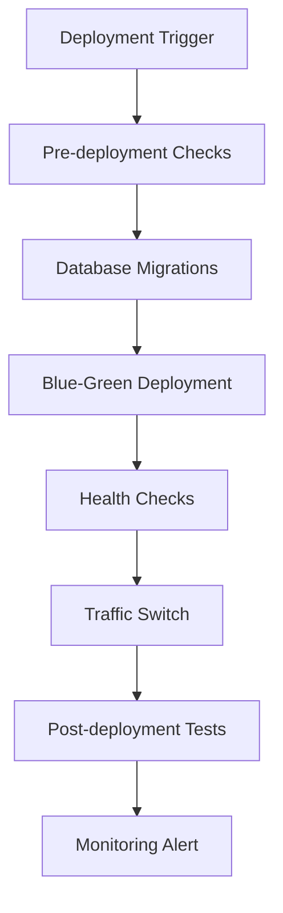

# {{PROJECT_NAME}} - Deployment Guide

**Last Updated:** {{DATE}}  
**Version:** {{VERSION}}  
**Maintainer:** {{MAINTAINER}}

## Overview

This document describes the deployment process, infrastructure setup, and CI/CD pipeline for {{PROJECT_NAME}}.

## Deployment Architecture



## Environments

### Development

| Component | Configuration | Access |
|-----------|---------------|--------|
| **Application** | {{DEV_APP_CONFIG}} | {{DEV_ACCESS}} |
| **Database** | {{DEV_DB_CONFIG}} | {{DEV_DB_ACCESS}} |
| **Storage** | {{DEV_STORAGE_CONFIG}} | {{DEV_STORAGE_ACCESS}} |

### Staging

| Component | Configuration | Access |
|-----------|---------------|--------|
| **Application** | {{STAGING_APP_CONFIG}} | {{STAGING_ACCESS}} |
| **Database** | {{STAGING_DB_CONFIG}} | {{STAGING_DB_ACCESS}} |
| **Storage** | {{STAGING_STORAGE_CONFIG}} | {{STAGING_STORAGE_ACCESS}} |

### Production

| Component | Configuration | Access |
|-----------|---------------|--------|
| **Application** | {{PROD_APP_CONFIG}} | {{PROD_ACCESS}} |
| **Database** | {{PROD_DB_CONFIG}} | {{PROD_DB_ACCESS}} |
| **Storage** | {{PROD_STORAGE_CONFIG}} | {{PROD_STORAGE_ACCESS}} |

## CI/CD Pipeline

### Build Process



#### Build Steps

1. **Code Checkout**: {{CHECKOUT_PROCESS}}
2. **Dependency Installation**: {{DEPENDENCY_INSTALL}}
3. **Testing**: {{TEST_PROCESS}}
4. **Security Scanning**: {{SECURITY_SCAN}}
5. **Artifact Creation**: {{ARTIFACT_CREATION}}
6. **Registry Push**: {{REGISTRY_PUSH}}

### Deployment Process



#### Deployment Steps

1. **Pre-deployment**: {{PRE_DEPLOYMENT_CHECKS}}
2. **Database Migration**: {{DB_MIGRATION_PROCESS}}
3. **Application Deployment**: {{APP_DEPLOYMENT_PROCESS}}
4. **Health Verification**: {{HEALTH_CHECK_PROCESS}}
5. **Traffic Routing**: {{TRAFFIC_ROUTING}}
6. **Post-deployment**: {{POST_DEPLOYMENT_CHECKS}}

## Infrastructure

### Container Configuration

```dockerfile
{{DOCKERFILE_CONTENT}}
```

### Kubernetes Manifests

```yaml
{{KUBERNETES_MANIFESTS}}
```

### Infrastructure as Code

```hcl
{{TERRAFORM_CONFIG}}
```

## Monitoring & Alerting

### Health Checks

| Endpoint | Purpose | Timeout | Retry |
|----------|---------|---------|-------|
| {{HEALTH_ENDPOINT_1}} | {{HEALTH_PURPOSE_1}} | {{TIMEOUT_1}} | {{RETRY_1}} |
| {{HEALTH_ENDPOINT_2}} | {{HEALTH_PURPOSE_2}} | {{TIMEOUT_2}} | {{RETRY_2}} |

### Monitoring Metrics

- **Application Metrics**: {{APP_METRICS}}
- **Infrastructure Metrics**: {{INFRA_METRICS}}
- **Business Metrics**: {{BUSINESS_METRICS}}

### Alerting Rules

{{ALERTING_RULES}}

## Security

### Deployment Security

- **Image Scanning**: {{IMAGE_SCANNING}}
- **Secret Management**: {{SECRET_MANAGEMENT}}
- **Network Security**: {{NETWORK_SECURITY}}
- **Access Control**: {{ACCESS_CONTROL}}

### Compliance

{{COMPLIANCE_REQUIREMENTS}}

## Rollback Procedures

### Automatic Rollback

{{AUTOMATIC_ROLLBACK}}

### Manual Rollback

```bash
# Manual rollback commands
{{ROLLBACK_COMMANDS}}
```

### Rollback Verification

{{ROLLBACK_VERIFICATION}}

## Scaling

### Horizontal Scaling

{{HORIZONTAL_SCALING}}

### Vertical Scaling

{{VERTICAL_SCALING}}

### Auto-scaling Configuration

```yaml
{{AUTOSCALING_CONFIG}}
```

## Disaster Recovery

### Backup Strategy

{{BACKUP_STRATEGY}}

### Recovery Procedures

{{RECOVERY_PROCEDURES}}

### RTO/RPO Targets

| Component | RTO | RPO | Strategy |
|-----------|-----|-----|----------|
| {{COMPONENT_1}} | {{RTO_1}} | {{RPO_1}} | {{STRATEGY_1}} |
| {{COMPONENT_2}} | {{RTO_2}} | {{RPO_2}} | {{STRATEGY_2}} |

## Troubleshooting

### Common Deployment Issues

#### {{DEPLOYMENT_ISSUE_1}}

**Symptoms:** {{SYMPTOMS_1}}  
**Cause:** {{CAUSE_1}}  
**Resolution:** {{RESOLUTION_1}}

#### {{DEPLOYMENT_ISSUE_2}}

**Symptoms:** {{SYMPTOMS_2}}  
**Cause:** {{CAUSE_2}}  
**Resolution:** {{RESOLUTION_2}}

### Debugging Commands

```bash
# Deployment debugging
{{DEBUG_COMMANDS}}
```

### Log Analysis

{{LOG_ANALYSIS}}

## Performance Optimization

### Resource Optimization

{{RESOURCE_OPTIMIZATION}}

### Caching Strategy

{{CACHING_STRATEGY}}

### CDN Configuration

{{CDN_CONFIGURATION}}

## Cost Optimization

### Resource Costs

| Resource | Monthly Cost | Optimization |
|----------|-------------|--------------|
| {{RESOURCE_1}} | {{COST_1}} | {{OPTIMIZATION_1}} |
| {{RESOURCE_2}} | {{COST_2}} | {{OPTIMIZATION_2}} |

## References

- [Architecture Documentation](architecture.md) - System design overview
- [Dependencies Documentation](dependencies.md) - External service dependencies
- [Operations Documentation](database-operations.md) - Operational procedures

---

*Keep this document updated with infrastructure and deployment changes.*
