# {{PROJECT_NAME}} - Developer Onboarding Guide

**Last Updated:** {{DATE}}

## Welcome to {{PROJECT_NAME}}! 🎉

This guide will help you get started as a developer on the {{PROJECT_NAME}} project.

## Prerequisites

### Required Tools

- {{TECH_STACK_REQUIREMENTS}}
- Git
- {{IDE_RECOMMENDATIONS}}

### Account Requirements

- GitHub account with repository access
- {{ADDITIONAL_ACCOUNTS}}

## Quick Start

### Setup Flow

```mermaid
flowchart TD
    A[Clone Repository] --> B[Install Dependencies]
    B --> C[Environment Setup]
    C --> D[Database Setup]
    D --> E[Run Tests]
    E --> F[Start Dev Server]
    F --> G[Verify Setup]
    
    B --> B1{Dependencies OK?}
    B1 -->|No| B2[Check Prerequisites]
    B2 --> B
    B1 -->|Yes| C
    
    D --> D1{Database Required?}
    D1 -->|No| E
    D1 -->|Yes| D2[Setup Database]
    D2 --> E
    
    E --> E1{Tests Pass?}
    E1 -->|No| E2[Fix Issues]
    E2 --> E
    E1 -->|Yes| F
    
    G --> H[Ready to Develop! 🎉]
```



### 1. Repository Setup

```bash
# Clone the repository
git clone {{REPOSITORY_URL}}
cd {{PROJECT_NAME}}

# Install dependencies
{{INSTALL_COMMANDS}}
```

### 2. Environment Configuration

```bash
# Copy environment template
cp .env.example .env

# Configure your local environment
# Edit .env with your local settings
```

### 3. Database Setup (if applicable)

```bash
{{DATABASE_SETUP_COMMANDS}}
```

### 4. Verification

```bash
# Run tests to verify setup
{{TEST_COMMANDS}}

# Start development server
{{DEV_SERVER_COMMANDS}}
```

## Development Workflow

### Workflow Diagram

```mermaid
gitgraph
    commit id: "Initial"
    branch develop
    checkout develop
    commit id: "Setup"
    
    branch feature/new-feature
    checkout feature/new-feature
    commit id: "Feature work"
    commit id: "Tests added"
    
    checkout develop
    merge feature/new-feature
    commit id: "Feature merged"
    
    checkout main
    merge develop
    commit id: "Release"
    
    branch hotfix/critical-fix
    checkout hotfix/critical-fix
    commit id: "Hotfix"
    
    checkout main
    merge hotfix/critical-fix
    commit id: "Hotfix deployed"
```

### Branch Management

- `main` - Production-ready code
- `develop` - Integration branch for features
- `feature/*` - Feature development branches
- `hotfix/*` - Critical bug fixes

### Code Standards

- Follow the project's coding standards (see {{STYLE_GUIDE_LINK}})
- Run linters and formatters before committing
- Write tests for new functionality
- Update documentation for API changes

### Commit Guidelines

Follow conventional commit format:

```
type(scope): description

Examples:
feat(auth): add user login functionality
fix(api): resolve timeout issue in user endpoint
docs(readme): update installation instructions
```

## Project Structure

```
{{PROJECT_STRUCTURE}}
```

### Key Directories

- `{{SOURCE_DIR}}` - Main application code
- `{{TESTS_DIR}}` - Test files
- `{{DOCS_DIR}}` - Project documentation
- `{{CONFIG_DIR}}` - Configuration files

## Development Environment

### Local Development

{{LOCAL_DEV_INSTRUCTIONS}}

### Testing

```bash
# Run all tests
{{TEST_ALL_COMMAND}}

# Run specific test suite
{{TEST_SPECIFIC_COMMAND}}

# Run with coverage
{{TEST_COVERAGE_COMMAND}}
```

### Debugging

{{DEBUGGING_INSTRUCTIONS}}

## Architecture Overview

{{ARCHITECTURE_SUMMARY}}

### Key Components

{{KEY_COMPONENTS}}

### Data Flow

{{DATA_FLOW_DESCRIPTION}}

## API Documentation

{{API_DOCS_LOCATION}}

### Authentication

{{AUTH_MECHANISM}}

### Key Endpoints

{{KEY_ENDPOINTS}}

## Common Tasks

### Adding a New Feature

1. Create feature branch: `git checkout -b feature/your-feature-name`
2. Implement the feature following coding standards
3. Add/update tests
4. Update documentation if needed
5. Submit pull request

### Fixing a Bug

1. Create hotfix branch: `git checkout -b hotfix/bug-description`
2. Fix the issue
3. Add regression test
4. Submit pull request

### Database Changes

{{DATABASE_MIGRATION_PROCESS}}

## Troubleshooting

### Common Issues

#### Issue: {{COMMON_ISSUE_1}}

**Solution:** {{SOLUTION_1}}

#### Issue: {{COMMON_ISSUE_2}}

**Solution:** {{SOLUTION_2}}

### Getting Help

- Check existing documentation in `{{DOCS_DIR}}`
- Search closed issues in GitHub
- Ask questions in {{COMMUNICATION_CHANNEL}}
- Contact: {{MAINTAINER_CONTACT}}

## Resources

### Documentation

- [Architecture Documentation]({{ARCH_DOC_LINK}})
- [API Documentation]({{API_DOC_LINK}})
- [Contributing Guidelines]({{CONTRIBUTING_LINK}})

### External Resources

- {{EXTERNAL_RESOURCES}}

### Learning Resources

- {{LEARNING_RESOURCES}}

## Next Steps

1. **Complete Setup**: Ensure all prerequisites are installed and working
2. **Explore Codebase**: Familiarize yourself with the project structure
3. **Run Examples**: Try the example applications or features
4. **Pick First Issue**: Look for "good first issue" labels in GitHub
5. **Join Community**: Introduce yourself in {{COMMUNICATION_CHANNEL}}

## Feedback

This onboarding guide is a living document. If you encounter issues or have suggestions for improvement, please:

- Open an issue with the "documentation" label
- Submit a pull request with improvements
- Provide feedback to {{FEEDBACK_CONTACT}}

---

**Need Help?** Don't hesitate to reach out to the team at {{SUPPORT_CONTACT}} or in {{COMMUNICATION_CHANNEL}}.
