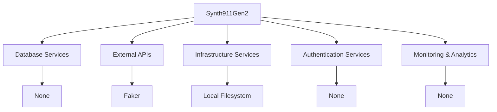

# Synth911Gen2 - Dependencies

**Last Updated:** June 2024  
**Version:** 0.5.0  
**Maintainer:** Tony Dunsworth

## Overview

This document outlines external dependencies, service integrations, and third-party components used by Synth911Gen2.

## Dependency Architecture



## Critical Dependencies

### Database Services

| Service | Type | Purpose | Criticality | Fallback |
|---------|------|---------|-------------|----------|
| None | N/A | N/A | N/A | N/A |

### External APIs

| Service | Provider | Purpose | Rate Limits | SLA |
|---------|----------|---------|-------------|-----|
| Faker | joke2k | Fake data generation | None | N/A |

## Infrastructure Dependencies

### Cloud Services

| Service | Provider | Purpose | Region | Backup Region |
|---------|----------|---------|--------|---------------|
| None | N/A | N/A | N/A | N/A |

### CDN and Storage

N/A

## Authentication & Authorization

### Identity Providers

| Provider | Type | Purpose | Users | Integration |
|----------|------|---------|-------|-------------|
| None | N/A | N/A | N/A | N/A |

## Monitoring & Observability

### Monitoring Services

N/A

### Analytics Services

N/A

## Package Dependencies

### Production Dependencies

```json
{
  "polars": "^0.20.0",
  "faker": "^19.0.0",
  "flask": "^2.0.0"
}
```

### Development Dependencies

```json
{
  "pytest": "^7.0.0",
  "bandit": "^1.7.0"
}
```

## Dependency Management

### Version Pinning Strategy

Pin major versions in requirements.txt

### Update Schedule

- **Security Updates**: Monthly
- **Minor Updates**: Quarterly
- **Major Updates**: Annually

### Vulnerability Scanning

Run bandit on codebase

## Service Level Agreements

### Uptime Requirements

| Service | Required Uptime | Actual SLA | Monitoring |
|---------|----------------|------------|------------|
| Faker | N/A | N/A | N/A |

### Performance Requirements

N/A

## Disaster Recovery

### Service Failover

N/A

### Data Backup Dependencies

User-managed

## Cost Management

### Service Costs

| Service | Monthly Cost | Usage Metrics | Cost Optimization |
|---------|-------------|---------------|-------------------|
| Faker | $0 | N/A | Open source |

## Security Considerations

### Third-Party Security

Review dependencies for vulnerabilities

### Data Sharing Agreements

N/A

## Compliance

### Regulatory Requirements

N/A

### Audit Requirements

N/A

## Troubleshooting

### Common Issues

#### Faker not installed
**Symptoms:** ImportError
**Resolution:** pip install faker

### Health Checks

```bash
python -c "import polars, faker, flask; print('All dependencies installed')"
```

## References

- [Architecture Documentation](architecture.md)
- [Security Documentation](data-security.md)

---

*This document is auto-generated and should be reviewed for accuracy and completeness.* 