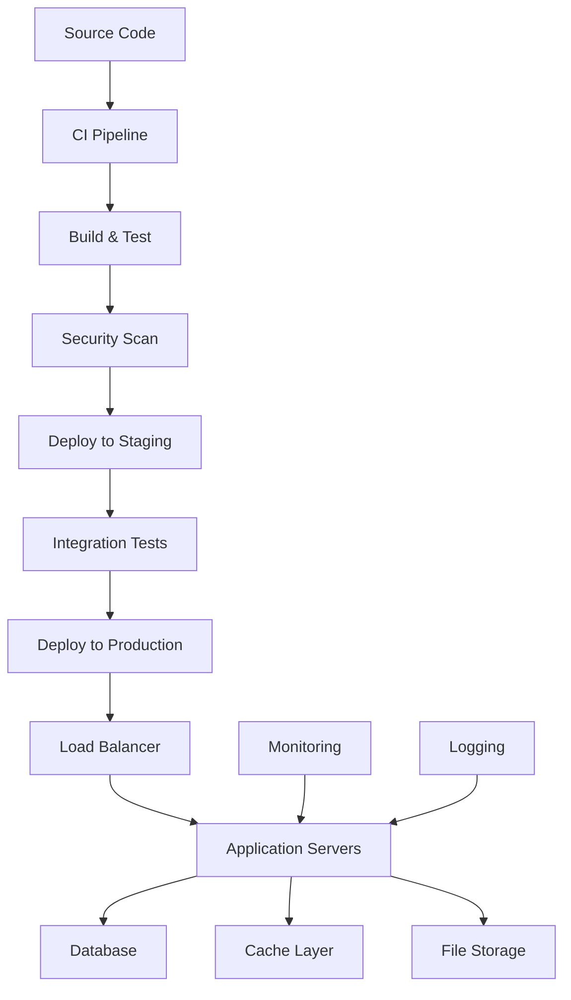
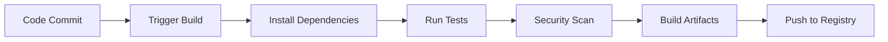
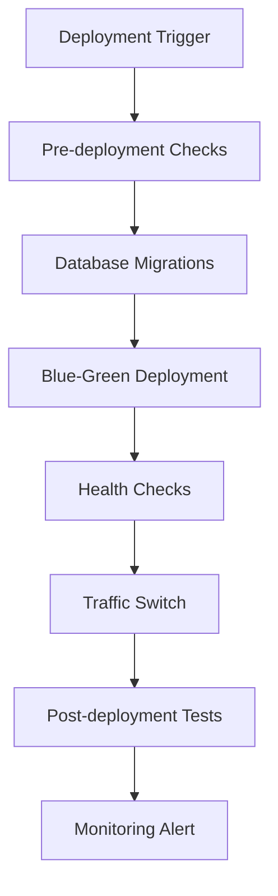

# Synth911Gen2 - Deployment Guide

**Last Updated:** June 2024  
**Version:** 0.5.0  
**Maintainer:** Tony Dunsworth

## Overview

This document describes the deployment process, infrastructure setup, and CI/CD pipeline for Synth911Gen2.

## Deployment Architecture



## Environments

### Development

| Component | Configuration | Access |
|-----------|---------------|--------|
| **Application** | Local Python | Local |
| **Database** | N/A | N/A |
| **Storage** | Local filesystem | Local |

### Staging

| Component | Configuration | Access |
|-----------|---------------|--------|
| **Application** | Docker | Internal |
| **Database** | N/A | N/A |
| **Storage** | Docker volume | Internal |

### Production

| Component | Configuration | Access |
|-----------|---------------|--------|
| **Application** | Docker | Public |
| **Database** | N/A | N/A |
| **Storage** | Docker volume | Public |

## CI/CD Pipeline

### Build Process



#### Build Steps

1. **Code Checkout**: git clone
2. **Dependency Installation**: pip install -r requirements.txt
3. **Testing**: pytest
4. **Security Scanning**: bandit
5. **Artifact Creation**: Docker build
6. **Registry Push**: Docker push

### Deployment Process



#### Deployment Steps

1. **Pre-deployment**: Lint, test, security scan
2. **Database Migration**: N/A
3. **Application Deployment**: Docker run
4. **Health Verification**: Manual or automated check
5. **Traffic Routing**: N/A
6. **Post-deployment**: Monitor logs

## Infrastructure

### Container Configuration

```dockerfile
FROM python:3.11-slim
WORKDIR /app
COPY . .
RUN pip install -r requirements.txt
CMD ["python", "main.py"]
```

### Kubernetes Manifests

N/A (can be added if needed)

### Infrastructure as Code

N/A (can be added if needed)

## Monitoring & Alerting

### Health Checks

| Endpoint | Purpose | Timeout | Retry |
|----------|---------|---------|-------|
| /health | Liveness | 5s | 3 |

### Monitoring Metrics

- Application logs
- Error rates
- Data generation throughput

### Alerting Rules

- On error or crash

## Security

### Deployment Security

- Use official Python images
- Scan dependencies
- Restrict file permissions

### Compliance

- N/A

## Rollback Procedures

### Automatic Rollback

N/A

### Manual Rollback

```bash
docker stop synth911gen2 && docker rm synth911gen2
```

### Rollback Verification

Check logs and application status

## Scaling

### Horizontal Scaling

Run multiple containers

### Vertical Scaling

Increase container resources

### Auto-scaling Configuration

N/A

## Disaster Recovery

### Backup Strategy

Backup code and output files

### Recovery Procedures

Restore from backup

### RTO/RPO Targets

| Component | RTO | RPO | Strategy |
|-----------|-----|-----|----------|
| Application | 1h | 1h | Restore from backup |

## Troubleshooting

### Common Deployment Issues

#### Docker build fails
**Symptoms:** Build error
**Resolution:** Check Dockerfile and dependencies

#### Application does not start
**Symptoms:** Crash or error
**Resolution:** Check logs

### Debugging Commands

```bash
docker logs synth911gen2
```

### Log Analysis

Review logs for errors

## Performance Optimization

- Use slim Python images
- Optimize data generation code

## Cost Optimization

- Use local/dev environments for testing

---

*This document is auto-generated and should be reviewed for accuracy and completeness.* 