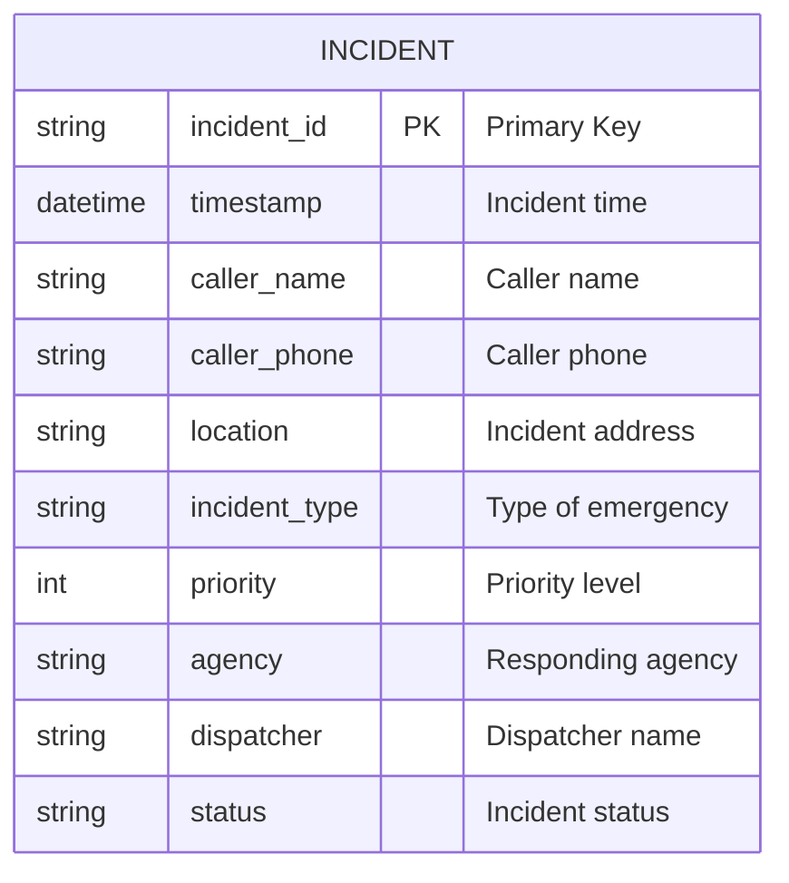

# Synth911Gen2 - Entity Relationship Diagram

**Last Updated:** June 2024  
**Version:** 0.5.0  
**Generated From:** Pandas DataFrame schema

## Database Overview

This document provides the entity relationship diagram for Synth911Gen2's output data schema.

### Entity Relationship Diagram

## Entity Descriptions

### INCIDENT

The main entity representing a 911 dispatch record.

**Primary Key:** incident_id  
**Table Name:** `INCIDENT`

#### Attributes

| Column | Type | Constraints | Description |
|--------|------|-------------|-------------|
| incident_id | string | PK | Unique incident identifier |
| timestamp | datetime |  | Date and time of the incident |
| caller_name | string |  | Name of the person reporting |
| caller_phone | string |  | Phone number |
| location | string |  | Incident address |
| incident_type | string |  | Type of emergency |
| priority | int |  | Priority level (1-5) |
| agency | string |  | Responding agency |
| dispatcher | string |  | Dispatcher name |
| status | string |  | Incident status |

#### Relationships

- None (flat structure)

## Relationship Details

- No foreign keys or relationships; each record is independent.

## Database Constraints

### Primary Keys

| Table | Primary Key | Type |
|-------|-------------|------|
| INCIDENT | incident_id | string |

### Foreign Keys

- None

### Unique Constraints

- incident_id is unique

### Check Constraints

- priority between 1 and 5

## Indexes

### Performance Indexes

| Table | Index Name | Columns | Type | Purpose |
|-------|------------|---------|------|---------|
| INCIDENT | idx_incident_id | incident_id | unique | Fast lookup |

## Data Types Used

### Standard Types

| Type | Usage | Description |
|------|-------|-------------|
| string | All text fields | Textual data |
| int | priority | Integer priority |
| datetime | timestamp | Date/time |

## Business Rules

- Each incident must have a unique incident_id
- Priority must be between 1 and 5

## Migration Notes

### Schema Version

**Current Version:** 1.0  
**Last Migration:** June 2024

### Migration History

| Version | Date | Description | Script |
|---------|------|-------------|--------|
| 1.0 | June 2024 | Initial schema | N/A |

## References

- [Core API Documentation](api/core.md)

---

*This document is auto-generated and should be reviewed for accuracy and completeness.* 